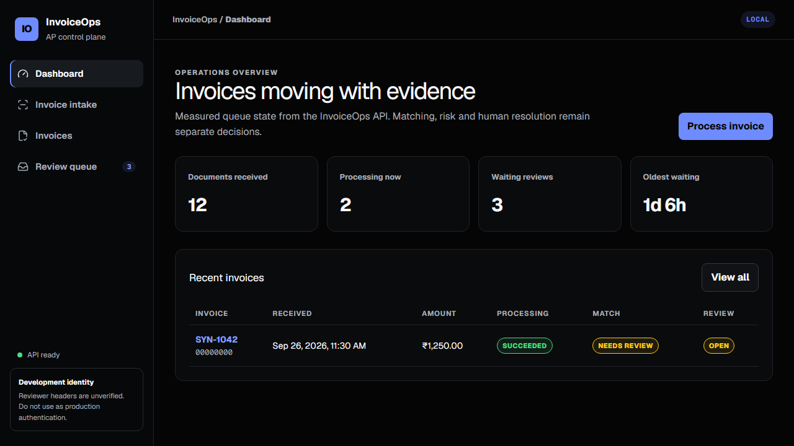

# InvoiceOps

InvoiceOps is an evidence-first accounts-payable automation project. AI handles document
perception and ambiguity; deterministic code performs arithmetic and applies matching policy.
Neither extraction nor matching authorizes payment. Only synthetic or de-identified financial
documents belong in this repository.

## Measured results at a glance

| Evaluation | Scope | Key measured result |
| --- | --- | --- |
| Deterministic extraction 0.2.0 | 15-document synthetic holdout in Docker | 100% header overall exact, 100% exact line-item F1, 0 failures |
| Hybrid replay 0.3.0 | 12 synthetic stress documents, no network | 93.06% header coverage, 100% line-item F1, all grounded conflicts abstained |
| Supporting documents 0.2.0, before | 30 generated PDF/PNG documents in Docker | PO number 0/10; receipt/delivery PO reference 0/20; PO line F1 1.0 |
| Supporting documents 0.3.0, Docker OCR regression | 30/30 generated PDF/PNG documents | PO number 10/10; receipt/delivery PO reference 20/20; PO line F1 1.0 |
| New supporting panel family, Docker OCR | 30/30 separately generated PDF/PNG documents | PO number 10/10; receipt/delivery PO reference 20/20; PO line F1 1.0 |
| Two-way matching v1 | 18 synthetic business scenarios | 100% expected-decision accuracy, 0 false auto-matches |
| Review workflow v1 | 17 synthetic state/concurrency scenarios | 100% category accuracy, 0 false automatic resolutions |
| Duplicate risk v1 | 25 synthetic business scenarios | 100% disposition/signal accuracy, 0 known-duplicate false clears |
| Three-way matching v1 | 26 synthetic receiving scenarios | 100% expected-decision accuracy, 0 false auto-matches |
| DocILE external context | Fixed 100-document validation sample | supported LIR F1 18.49% end-to-end / 22.28% precomputed OCR; supported KILE F1 0% |
| DocILE localization candidate, external context | Full 500-document validation split | supported KILE F1 12.23% end-to-end / 14.38% precomputed OCR; unchanged supported LIR F1 4.09% / 5.18% |
| DocILE line-coverage candidate 0.4.0, external context | Same observed 500-document validation split | supported LIR F1 4.09% -> 4.14% / 5.18% -> 5.23%; one extra TP and FP per mode, lower micro precision; opt-in null result |

Synthetic results are project measurements, not production claims. DocILE results are reported
separately as an external stress benchmark and expose the deterministic baseline's generalization
limits.

The DocILE localization candidate is evaluated separately from the frozen baseline.
See [the aggregate failure analysis and targeted fix](docs/docile-failure-analysis.md) for
value-only source evidence, the 500-document validation scope, and immutable report outputs.
See [invoice line-item coverage](docs/invoice-line-coverage.md) for stage diagnostics, official
per-field counts, the bounded two-column candidate, and the decision against production promotion.
The entire validation split is observed development data, not a fresh holdout.

```text
invoice -> extraction + evidence -> TWO_WAY: invoice + PO ---------+
                                  -> THREE_WAY: + receipts/reversals | -> match decision
                                                + reconciled allocation
                                                                     + -> duplicate risk
                                                                     + -> human review
                                                                          -> audit chain
all stages -> correlated logs + OTLP traces/metrics -> Collector -> Tempo/Prometheus -> Grafana
```

## Operations console

The production-style Next.js console exposes invoice intake, durable live processing, invoice and
evidence inspection, deterministic match/risk results, and optimistic-concurrency human review.
It is a thin operations layer: every arithmetic result, policy decision, event and audit version
comes from the FastAPI service.



A useful demonstration path is: upload synthetic invoice, PO and receipt evidence at `/intake`,
watch the resumable event timeline, confirm supporting evidence at `/cases/{case_id}`, then
claim and resolve any generated exception at `/reviews/{case_id}`. Local synthetic login is only
for development; an accepted exception is not payment authorization.

## Implemented vertical slice

The preferred intake path is now a versioned payable case. `POST /v1/cases` creates the durable
aggregate and `POST /v1/cases/{case_id}/documents` attaches actual invoice, purchase-order,
goods-receipt or delivery-note PDF/JPEG/PNG evidence. Attachment mutations use an idempotency key,
canonical payload fingerprint and expected case version. Raw bytes still use the global SHA-256
document identity, so retries and cross-case reuse do not duplicate storage.

Purchase-order and receipt extraction is typed and evidence-linked, but never authoritative.
The current supporting extractor is `deterministic-supporting-documents@0.3.0`; its unified PO
table parser separates printed line numbers from descriptions. The optional supporting hybrid is
`supporting-hybrid-routed@0.4.0`. The six-case before report remains frozen; a generated synthetic
document holdout records both improvements and remaining failures.
Confirmation endpoints create canonical records only after explicit human confirmation, while the
original extraction JSON remains immutable. Case matching consumes only confirmed records and
delegates arithmetic, policy, risk and review routing to the existing deterministic services.
Document roles are user-selected, not automatically classified. No outcome authorizes payment.

`POST /v1/invoices` accepts one PDF, JPEG, or PNG (15 MiB by default), stores it in S3-compatible
object storage, creates a durable queued job in PostgreSQL, dispatches it through Celery/Redis, and
returns `202 Accepted` with job, document, status, and extraction URLs. `GET /v1/jobs/{job_id}`
returns the job state. `GET /v1/jobs/{job_id}/events` provides resumable durable SSE processing
events. `GET /v1/invoices/{document_id}/extraction` returns the current versioned
extraction state and, when complete, the typed invoice with source evidence.

The worker downloads the stored document, performs text/OCR preprocessing and deterministic header
extraction, and persists one result per document, extractor name, and extractor version. Celery
redelivery reuses a completed extraction instead of repeating it.

An optional deterministic-first vision fallback is implemented as `hybrid-routed@0.4.0` while the
frozen `deterministic-baseline@0.2.0` remains intact. The router invokes a provider only for typed
quality failures. Strict model candidates require a uniquely located quote and a unique source-token
value span inside it that normalizes to the proposed value. Numeric fuzzy digit substitutions are
rejected. Grounded conflicts become `AMBIGUOUS`; provider failure preserves the
deterministic invoice. The VLM is disabled and model-less by default, and confidence never
authorizes matching, approval, or payment.

The deterministic matching slice accepts typed purchase orders, validates invoice
arithmetic, and compares an explicitly selected PO with a successful extraction. Matching is
synchronous and returns only `MATCHED` or `NEEDS_REVIEW`, with versioned tolerances, reason codes,
line assignments, and invoice evidence. Ambiguous, incomplete, or inconsistent observations can
never produce `MATCHED`; no model makes arithmetic or approval decisions. Explicit `THREE_WAY`
mode adds immutable goods receipts, reversals, cumulative receipt allocations and a fingerprinted
historical context. Existing requests remain two-way by default.

Every `NEEDS_REVIEW` result now opens exactly one evidence-linked case and opening audit event in
the same transaction as the immutable match run. Reviewers can claim, comment, release and resolve
with optimistic concurrency and ownership checks. Events form an application-level SHA-256 chain
that can reconstruct materialized state. Reviewer identity comes from a verified access token in
OIDC mode; local identity headers are development-only. `ACCEPTED_EXCEPTION` never authorizes payment.

Every match also receives one immutable `duplicate-risk-v1` assessment. It compares normalized
business features with prior assessments and emits explicit exact-key, reused-number, same-PO,
near-duplicate or incomplete-check signals—never an opaque score. A `MATCHED` invoice can be routed
to the same review queue without changing its match decision. Risk never rejects an invoice or
authorizes payment. See [the risk guide](docs/risk.md).

Uploads are idempotent by SHA-256: repeated bytes reuse the existing document and job, including
under concurrent requests through a unique database index. API and worker application events are
JSON structured logs. Celery uses late acknowledgement, safe redelivery, bounded exponential
retry, and a terminal failed state.

## Run locally

Container builds and Compose use public publisher registries or Google's Docker Hub cache,
avoiding unauthenticated Docker Hub pull limits on shared CI runners. Image version tags and
validation gates are unchanged; no registry secrets are required. The migration service uses
the mirror directly because GitHub starts service containers before workflow steps.
[Google documents the cache](https://docs.cloud.google.com/artifact-registry/docs/pull-cached-dockerhub-images)
as a subset of Docker Hub images: tags can be evicted, so an unavailable cached image should
be replaced with a verified publisher registry or authenticated source, rather than skipping checks.

```powershell
Copy-Item .env.example .env
docker compose up --build
```

The web console is at `http://localhost:3000`, API docs are at `http://localhost:8000/docs`, and
Grafana is at `http://localhost:3001`. Docker Compose runs Alembic migrations before
starting the API or worker and uses S3Mock only for synthetic local object storage.
For the local telemetry stack, follow [the observability guide](docs/observability.md).
Frontend setup, contract generation and browser tests are in [the web console guide](docs/web-console.md).
OIDC, local synthetic login, the RBAC matrix and production configuration are in [the authentication guide](docs/authentication.md).
An opt-in synthetic Keycloak walkthrough is in [the local OIDC smoke runbook](docs/oidc-smoke.md);
it passed 4/4 local browser tests on 2026-10-08, is not enabled by default, and does
not constitute production identity-provider validation.

Run local quality checks:

```powershell
uv sync
uv run pytest -m "not docker and not docile"
uv run ruff check .
uv run mypy apps invoiceops workers
```

Create a retry-safe case through the API:

```powershell
$case = Invoke-RestMethod -Method Post -Uri http://localhost:8000/v1/cases `
  -ContentType application/json -Body '{"idempotency_key":"demo-case-001"}'
curl.exe -X POST "http://localhost:8000/v1/cases/$($case.id)/documents" `
  -F "file=@synthetic-invoice.pdf;type=application/pdf" -F "role=INVOICE" `
  -F "idempotency_key=demo-invoice-001" -F "expected_case_version=$($case.version)"
```

Run frontend contract, type, unit, accessibility and visual checks:

```powershell
uv run python scripts/export_openapi.py
Set-Location web
pnpm install --frozen-lockfile
pnpm openapi
pnpm typecheck
pnpm lint
pnpm test
pnpm build
pnpm exec playwright install chromium
pnpm test:e2e
```

Run marker-specific suites explicitly when their required environment is available:

```powershell
uv run pytest -m docile
uv run pytest -m docker
```

Private DocILE tests require `DOCILE_DATASET_PATH`. Docker tests are normally run through the
Compose command below, which supplies the real service dependencies and `API_BASE_URL`.

Run the real PostgreSQL/Redis/S3-compatible-storage/worker black-box tests in Compose:

```powershell
docker compose build api
docker compose --profile test build integration-tests
docker compose up --no-build -d --wait --wait-timeout 180 api worker
docker compose --profile test run --rm --no-deps integration-tests

docker compose --profile hybrid-test build integration-tests-hybrid
docker compose --profile hybrid-test up --no-build -d --wait --wait-timeout 180 api worker-hybrid-fake
docker compose --profile hybrid-test run --rm --no-deps integration-tests-hybrid
docker compose down
```

Run the reproducible synthetic evaluation corpus:

```powershell
uv run python scripts/generate_synthetic_evaluation.py
uv run python -m invoiceops.evaluation --manifest evals/manifests/dev.jsonl --output-dir evals/reports/development
uv run python -m invoiceops.evaluation --manifest evals/manifests/holdout.jsonl --output-dir evals/reports/holdout/0.2.0 --allow-holdout
```

The holdout flag is mandatory. Reports contain normalized predictions and aggregate metrics, not
raw page text or evidence snippets. Metric definitions and denominator policies are documented in
[the evaluation guide](docs/evaluation.md).

Run the deterministic business-scenario evaluation:

```powershell
uv run python scripts/run_matching_evaluation.py
Get-Content evals/reports/matching/matching-v1/report.md
```

The 18 scenarios are synthetic. Their aggregate result is engineering evidence, not a production
accuracy claim. The safety invariant is `false_auto_match_count == 0`.

Run the deterministic three-way matching evaluation:

```powershell
uv run python scripts/run_three_way_evaluation.py
Get-Content evals/reports/matching/three-way-v1/report.md
```

It covers fully/partially received goods, multiple receipts, cumulative invoicing, reversals,
receipt timing, missing receipts, over-receipt, over-invoicing and policy boundaries. The offline
metric is sequential; real PostgreSQL contention is exercised by the Compose integration suite.

Run the network-free hybrid replay evaluation:

```powershell
uv run python scripts/run_hybrid_evaluation.py --mode hybrid-replay --output-dir evals/reports/hybrid/0.4.0-replay-local
Get-Content evals/reports/hybrid/0.4.0-replay-local/report.md
```

Live mode is guarded and requires explicit manifest wiring, `--allow-live`, an enabled provider,
an explicitly selected model, and credentials. Ordinary tests and CI make no live provider calls.

Run the synthetic review-workflow evaluation:

```powershell
uv run python scripts/run_review_evaluation.py
Get-Content evals/reports/review/review-v1/report.md
```

It covers allowed and invalid transitions, stale versions, ownership, repeated requests and the
false-automatic-resolution safety invariant.

Run the deterministic duplicate-risk evaluation:

```powershell
uv run python scripts/run_duplicate_risk_evaluation.py
Get-Content evals/reports/risk/duplicate-risk-v1/report.md
```

Its 25 scenarios are synthetic, not production fraud-detection claims. CI requires zero known
duplicate false clears and zero duplicate assessments.

OCR-bearing manifests require Tesseract before any document bytes are processed. Run the frozen
holdout in the reproducible evaluation container:

```powershell
docker compose --profile evaluation run --rm evaluator `
  --manifest evals/manifests/holdout.jsonl `
  --output-dir evals/reports/synthetic/0.2.0-container `
  --allow-holdout
```

DocILE tooling is isolated in the `evaluation` dependency group. External documents, OCR and raw
predictions are ignored; only ID-only manifests and aggregate reports may be committed. See the
[DocILE field mapping](docs/docile-field-mapping.md).

Run the two-mode DocILE smoke benchmark in the Tesseract-enabled evaluation container after setting
`DOCILE_DATASET_PATH`:

```powershell
docker compose --profile evaluation run --rm --build --entrypoint python evaluator `
  scripts/run_docile_evaluation.py --dataset-path /data/docile `
  --sample-manifest data/docile/manifests/smoke.json `
  --output-dir evals/reports/docile/0.2.0-smoke
```

See the [evaluation guide](docs/evaluation.md#docile-external-benchmark) for dataset placement and
the fixed 100-document command.

## API example

```powershell
curl.exe -F "file=@synthetic-invoice.pdf;type=application/pdf" http://localhost:8000/v1/invoices
curl.exe http://localhost:8000/v1/jobs/JOB_ID
```

Purchase-order creation and matching examples, including both `MATCHED` and `NEEDS_REVIEW`, are in
[the two-way matching guide](docs/matching.md#api-demonstration).

## Product evidence

Initial discovery with a finance practitioner identified quantity, unit rate, counterparty, and
GST rate as frequent manual-entry fields. Escalation is driven by approval thresholds, mismatches,
disputes, and exceptional circumstances. Tolerances must be policy- and agreement-specific rather
than model-decided. Approvers may require a PO, order confirmation, advance evidence, and email
approval. These findings are product inputs, not measured system results.

See [architecture](docs/architecture.md) and [ADR-001](docs/adr/001-ingestion-boundary.md).
See [hybrid extraction](docs/hybrid-extraction.md) for routing, grounding, fusion, and privacy.
See [supporting-document vision fallback](docs/supporting-vlm.md) for the opt-in PO/receipt path,
human-confirmation boundary, frozen replay comparison, and generated PDF/PNG holdout.
See [two-way matching](docs/matching.md) for policy definitions, reason codes, API behavior, and
known limitations.
See [three-way matching](docs/three-way-matching.md) for receipt idempotency, context fingerprints,
allocation and concurrency behavior.

This project is available under the [MIT License](LICENSE).
See [human review](docs/review.md) for state transitions, concurrency, identity limitations,
evidence navigation, reconciliation and audit verification.
The delivery sequence is captured in [the roadmap](docs/roadmap.md).
The current slice is explained file-by-file in the
[implementation guide](docs/implementation-guide.md).
For exact Windows setup, smoke-test, troubleshooting, and cleanup commands, use the
[local runbook](docs/local-runbook.md).

## Deterministic extraction assumptions

Header extraction is rule-based and retains source coordinates for every selected value. Numeric
invoice dates use Indian day-first ordering (`DD/MM/YYYY` or `DD-MM-YYYY`); ISO dates use
`YYYY-MM-DD`. Ambiguous top-ranked values are returned as ambiguous instead of being guessed.
Money is parsed with `Decimal`, and the `$` symbol is not automatically treated as USD.

Line-item extraction detects positioned table headers and assigns words to inferred normalized
column ranges. Missing financial cells remain missing rather than being calculated. Wrapped
descriptions are joined only within the same detected table section and page; cross-page
description continuation is intentionally unsupported in the deterministic baseline.
