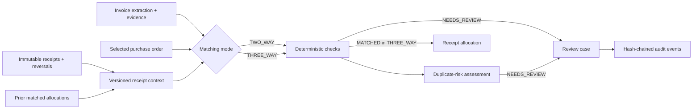

# Architecture

The upload path is deliberately small and durable:

```text
client -> FastAPI -> object storage
                  -> PostgreSQL job row -> Redis/Celery -> extraction worker
client <- 202 + job ID
client -> GET job status -> PostgreSQL
```

The database stores metadata and workflow state; original bytes stay in object storage. Every
document receives a content digest for future duplicate detection. The object is written before
the row is committed, and removed if that commit fails. If dispatch fails, the queued row remains
durable so a reconciliation process can safely redispatch it.

The current deterministic decision path supports explicit two-way and three-way modes:



```text
successful versioned extraction + explicitly selected purchase order
        -> financial validation
        -> exact/fuzzy deterministic one-to-one line assignment
        -> quantity, price, currency and line-amount checks
        -> MATCHED or NEEDS_REVIEW
        -> immutable policy snapshot + reason codes + invoice provenance
        -> versioned duplicate-risk assessment + explicit signals
        -> match NEEDS_REVIEW or risk NEEDS_REVIEW: one OPEN review case
        -> CASE_OPENED with immutable trigger snapshot in the same transaction
        -> claim / comment / release / resolve with optimistic concurrency
        -> versioned, append-only hash-chained events + state reconstruction
```

In `THREE_WAY` mode, immutable goods receipts and reversals are reduced into a fingerprinted
context before deterministic checks run. Only a `MATCHED` result creates cumulative receipt
allocations. Match, context, allocations, risk, review case and opening event share one transaction.

Extraction supplies observations and evidence. Matching code alone performs arithmetic and applies
the versioned policy. Match runs reference the exact extraction row and are idempotent across
retries. Review mutations use version compare-and-swap updates; each state update and its next
event commit together. Database uniqueness prevents duplicate cases and event sequence numbers.
The hash chain is tamper-evident at application level, not immutable against a database
administrator. Later slices add anomaly scoring and evaluation lineage.

Matching and duplicate risk are independent deterministic decisions. A `MATCHED` invoice can be
routed for duplicate review without mutating the match result, and neither decision authorizes
payment. See [risk.md](risk.md).

Queue triggers are normalized instead of filtering nested match JSON in memory:

```text
review case -> review_case_triggers(MATCH_REASON, reason code, match-run source)
            -> indexed queue filtering
            -> future duplicate/anomaly trigger types
```

The optional perception path is deterministic-first:

```text
stored document -> deterministic-baseline@0.2.0 (persisted)
                -> pure quality router
                    -> sufficient: hybrid-routed@0.3.0 copies canonical baseline
                    -> insufficient: bounded render -> strict VLM candidate
                                     -> quote-to-token grounding
                                     -> conservative deterministic fusion
                -> separate ExtractionRun + sanitized ModelCall lineage
                -> existing deterministic validation and PO matching
```

Provider construction is lazy. Images and document text are never logged, model boxes are ignored,
and document instructions are untrusted data. Request fingerprints make attempt persistence
idempotent. External exactly-once execution is not claimed: a crash between provider response and
database commit can cause an at-least-once retry, while a persisted success is reused. Read and
matching paths prefer successful 0.3.0, fall back to 0.2.0, and never rewrite historical matches.
